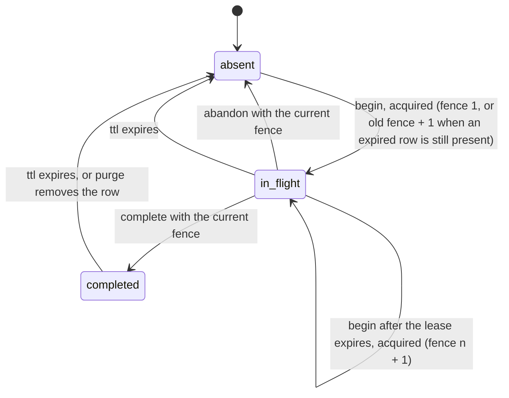

# Semantics

This page explains what anyonce does with a key, in both languages, and what it does not promise. The normative text is [requirements.md](../requirements.md) sections 3.1 to 3.3 and decisions D5, D6, D12 to D16; recorded resolutions are cited as Qn and live in [questions.md](superpowers/questions.md). Where the TypeScript and Go implementations differ, the difference is named.

Source of truth for the behavior described here: [`packages/core/src/engine.ts`](../packages/core/src/engine.ts) and [`go/anyonce/engine.go`](../go/anyonce/engine.go) for the engine, [`packages/core/src/http/run.ts`](../packages/core/src/http/run.ts), [`packages/core/src/http/capture.ts`](../packages/core/src/http/capture.ts) and [`go/internal/httpx/door.go`](../go/internal/httpx/door.go) for the HTTP bridge.

## The record and its states

Every idempotent operation is identified by `(scope, key)` and carries a `fingerprint` of its payload. The store holds at most one record per `(scope, key)`. A record is `in_flight` while a handler runs under a lease, `completed` once a result is stored, and `absent` when there is no row, the row is past `expiresAt`, or it was abandoned.

What `begin` answers for each state (requirements 3.2):

| Record found by `begin` | Same fingerprint | Different fingerprint |
|---|---|---|
| none, or `expiresAt <= now` | `acquired` | `acquired` |
| `in_flight`, lease live | `in_flight` with its `leaseUntil` | `mismatch` |
| `in_flight`, lease expired | `acquired`, fence + 1 | `mismatch` |
| `completed` | `completed` with the stored record | `mismatch` |

### Precedence inside `begin`

`begin` checks three things in a fixed order (requirements 3.2, Q8):

1. TTL first. A record with `expiresAt <= now` is absent, whatever its state or fingerprint.
2. Fingerprint second. A live record with a different fingerprint is `mismatch`, even if its lease has expired: the first payload under a key is the truth for the key's lifetime.
3. Lease last. A live `in_flight` record with a live lease is `in_flight`; with an expired lease it is taken over.

Fence continuation: when a TTL expired row is still physically present, the new claim's fence is `old.fence + 1`. When the store's native TTL has already deleted the row (DynamoDB, Redis) there is nothing to continue from, and the fence restarts at 1. The SQL stores compute `COALESCE(existing.fence, 0) + 1` in the same statement as the claim, so continuation costs nothing (Q8). Every store does this in one atomic operation; see [stores.md](stores.md).

## Lease and fence

The lease (`leaseMs`, default 30 s) is how long a claim is exclusive. It exists so a crashed worker cannot hold a key forever: once `leaseUntil` passes, the next `begin` with the same fingerprint takes the claim over. The fence is a counter per `(scope, key)` that goes up by one on every takeover. `complete` and `abandon` carry the fence of the claim they belong to, and a store refuses either one with `stale_fence` when the record's fence is higher, writing nothing (D5, REQ-STORE-5).

Worked example of a stale `complete`, with the default 30 s lease:

| Time | Worker A | Worker B | Record |
|---|---|---|---|
| t = 0 s | `begin` returns `acquired`, fence 1 | | `in_flight`, fence 1, `leaseUntil` 30 s |
| t = 10 s | handler stalls (GC pause, slow dependency) | retry arrives, `begin` returns `in_flight`, answered 409 with `Retry-After: 20` | unchanged |
| t = 31 s | still stalled | retry arrives, lease expired, `begin` returns `acquired`, fence 2 | `in_flight`, fence 2, `leaseUntil` 61 s |
| t = 35 s | | handler finishes, `complete(fence 2)` returns `ok` | `completed` with B's result |
| t = 40 s | handler finishes, `complete(fence 1)` returns `stale_fence` | | unchanged: B's result stays |

Worker A's handler did run, and so did Worker B's: the lease bounds exclusivity in time, it cannot stop a handler that outlives it. What the fence guarantees is that the late writer cannot overwrite the record the takeover produced, so every replay after t = 35 s returns B's result. The engine reports A's run as `executed` with `stored: false`. Choose `leaseMs` longer than the slowest handler you expect to finish.

## What the engine does

`execute` (TypeScript) and `Execute` (Go) are one state machine (requirements 3.3):

- `run` is invoked at most once per `acquired` outcome and never on `completed`, `in_flight` or `mismatch`.
- If `run` throws (TypeScript) or returns an error or panics (Go), the engine calls `abandon` with the claim's fence and rethrows, so the key is immediately free for a retry. In Go the error is wrapped (`anyonce: handler failed: %w`); a panic is recovered inside the doors, the claim abandoned, and the panic re-raised.
- If `storeResult(result)` is false, the engine calls `abandon` and returns `executed` with `stored: false`. The default `storeResult` stores every queue outcome and every HTTP status below 500 (D6), so a 5xx is delivered to the client once and the next retry runs the handler again.
- If the result body exceeds `maxResultBytes` (default 1 MiB, measured over the body only, Q17), the engine calls `complete` with the omitted form: status and headers are stored, the body is not (D12, Q7). A replay then returns the original status and headers, an empty body, and `Idempotency-Replay: omitted`. Both HTTP bridges lower `maxResultBytes` to the store's own limit when the store declares one, which only DynamoDB does (300 KiB, Q20).
- Hooks (`onAcquired`, `onReplayed`, `onConflict`, `onMismatch`, `onStoreError`) never throw into the engine; a throwing (or, in Go, panicking) hook is swallowed and counted in `hookErrors` when one is supplied.
- In Go, `Complete` and `Abandon` run under `context.WithoutCancel(ctx)`, so a client disconnect never leaves a record in flight that the handler already settled. `Begin` uses the caller's context.

### Store failures: fail-closed and fail-open

`onStoreError` is `'fail-closed'` by default (D13). What each mode means depends on where the store failed (Q15):

| Store failure at | fail-closed | fail-open |
|---|---|---|
| `begin` | `store_error`, the handler does not run (HTTP 503 `store-unavailable` with `Retry-After: 1`) | the handler runs with fence 0 and nothing is stored; HTTP marks the response `Idempotency-Degraded: true` |
| `complete` (throws) | `executed` with `stored: false` | `executed` with `stored: false` |
| `complete` answers `stale_fence` or `not_found` | `executed` with `stored: false` | `executed` with `stored: false` |
| `abandon` (throws) | swallowed; the error goes to `onStoreError` and the claim expires with its lease | same |

A failure at `complete` never becomes a 503 in either mode: the handler has already run, and hiding its result behind an error would make the client retry work that happened (Q15). `onStoreError` fires for every store failure in both modes. Under fail-open a `begin` failure means the handler runs without any claim, so concurrent duplicates can both run; that is the trade fail-open makes.

## Outcomes per door

### HTTP (`withIdempotency`, `@anyonce/hono`, Go `httpmw`)

Requirements 4.4. Only the configured methods (default `POST`, `PATCH`) are touched; anything else, and anything `skip` returns true for, passes straight through.

| Situation | Response |
|---|---|
| no key, `required: false` (default) | passes through, no record |
| no key, `required: true` | 400 `missing-key` with `Link: <docsUrl>; rel="describedby"` |
| key fails D7 syntax, or the header is repeated | 400 `invalid-key` |
| `requirePrincipal` and the principal function returns nothing | 500 `missing-principal` (Q18) |
| body over `maxRequestBytes` (default 1 MiB) | 413 `payload-too-large` |
| first request | the handler's response, streamed, stored when `storeResult` allows |
| completed duplicate | the stored status, allowlisted headers and body, plus `Idempotency-Replayed: true` (and `Idempotency-Replay: omitted` over the cap) |
| in-flight duplicate | 409 `conflict` with `Retry-After`: lease remaining in seconds, rounded up, at least 1 |
| same key, different payload | 422 `fingerprint-mismatch`; the original record is untouched |
| store down, fail-closed | 503 `store-unavailable` with `Retry-After: 1` |
| store down, fail-open | the handler's response with `Idempotency-Degraded: true` |

Every error is a problem details document; see [problems.md](problems.md). The handler learns its claim through `idempotencyOf(req)` (TypeScript), `c.get('idempotencyKey')` and `c.get('idempotencyFence')` (Hono), or `httpmw.KeyFromContext` and `httpmw.FenceFromContext` (Go), per REQ-HTTP-14. In Go, a handler that hijacks the connection disables idempotency for that request: the claim is abandoned and nothing is written (REQ-HTTP-18).

### Queue (`@anyonce/anyq`, Go `anyqmw`)

D15 and requirements 4.5. The door throws (TypeScript) or returns (Go) typed errors that the companion strategy, `idempotencyStrategy()` or `anyqmw.Strategy(inner)`, translates into anyq decisions (Q2, REQ-Q-8).

| Situation | What the door does | With the companion strategy |
|---|---|---|
| first delivery, handler succeeds | runs the handler, stores `{ kind: 'message', outcome: 'ok' }` | anyq acks |
| completed duplicate | returns success without running the handler | anyq acks |
| in-flight duplicate, `onInFlight: 'retry'` (default) | throws `InFlightError` with `delayMs` = lease remaining, at least 1 | `park(delayMs)` |
| in-flight duplicate, `onInFlight: 'ack'` | returns success without running the handler (at most once per lease) | anyq acks |
| same identity, different payload | throws `FingerprintMismatchError` (Go `*MismatchError`) | `deadLetter('fingerprint-mismatch')` |
| handler throws | abandons the claim and rethrows (REQ-Q-3) | delegated to the inner strategy, default `retryThenDeadLetter()` |
| store down at `begin`, fail-closed | rethrows the store error (Go wraps `ErrStoreUnavailable`) | delegated to the inner strategy |
| Go only: the context is cancelled while the handler runs | abandons the claim even if the handler returned nil (REQ-Q-7) | delegated to the inner strategy |

The stored result of a queue operation is always `{ outcome: 'ok' }`, never the payload (REQ-Q-5). D15's `{ outcome: 'error' }` arm exists in the type but is never written: a failure abandons the claim so anyq's retry and dead-letter policy apply unchanged, and replaying a stored failure for the whole TTL would take the message out of that policy (Q43). Without the companion strategy the typed errors reach anyq's legacy retry path, and the door logs one warning, once, when the next delivery shows that an `InFlightError` it threw was never translated. On adapters without native delay (Kafka, Redis Streams) anyq downgrades a park to an in-process wait that re-enters `begin` only after the lease has expired. Which key source survives a park on which adapter is in [queue-ids.md](queue-ids.md) (Q40).

### Webhook (`@anyonce/webhooks`, Go `webhookmw`)

D16 and requirements 4.6. The receiver runs its verification gate before anything touches the store, then hands the delivery to the same HTTP bridge with `webhook-id` (or the `key` function) as the key.

| Situation | Response |
|---|---|
| built with neither `verify` nor `verifiedMarker` | 500 `configuration-error`, logged once per receiver (checked before the method, so no handler ever runs) |
| method not in `methods` (default `POST`) | passes through |
| body over `maxRequestBytes` | 413 `payload-too-large` |
| `verify` throws (TypeScript) or returns an error (Go) | 500 `configuration-error`, logged once per receiver |
| `verify` returns false, or the verified marker is absent | 401 `signature-invalid` with `WWW-Authenticate: Signature` (Q29); the store is never called |
| TypeScript only: `skip` returns true | the handler runs without deduplication, after the gate |
| verified, no id (`required` defaults to true on this door, Q25) | 400 `missing-key` |
| id longer than 255 bytes or outside printable ASCII | 400 `invalid-key` (the id goes through the lenient parser, never strict sf-string, Q25) |
| first delivery | the handler's response, stored when `storeResult` allows |
| completed duplicate | the stored response with `Idempotency-Replayed: true` |
| in-flight duplicate | 409 `conflict` with `Retry-After` |
| same id, different body | 422 `fingerprint-mismatch`, and `onSuspicious(req, record)` fires |
| store down, fail-closed | 503 `store-unavailable` |

The webhook fingerprint is SHA-256 over the body bytes alone (D9), so the same delivery sent to two paths still matches. The default scope is `${routePattern}/${sourceId}`, or the route alone when no `sourceId` is supplied (Q24); see [security.md](security.md) for why that matters on a shared endpoint.

## Streaming and when a record completes

The HTTP bridge streams the handler's response to the client while buffering a copy for the store (REQ-HTTP-7). In TypeScript the copy is pull driven (Q19): the handler's body is read one chunk per client read, the record is completed only after the client has pulled the whole body, and the client sees end of stream only after `complete` has returned. Consequences:

- A duplicate that arrives while the first client is still receiving the body gets 409 with `Retry-After`, not a replay, because the record is still `in_flight`.
- A client that stalls without cancelling holds the claim until the lease expires. After that a retry takes the claim over (fence + 1), and the stalled request's eventual `complete` is refused as `stale_fence`, exactly as in the worked example above.
- A client that cancels hands the rest of the body to a free running drain, so the copy still completes and the record is stored.
- A 5xx is streamed the same way and abandoned only after its body has been read.

Go behaves the same way for bodies large enough to block on the socket: the handler writes through to the connection and the record completes when the handler returns. A small body fits in the server's write buffer, so a Go record can complete before the client has read anything. That is the one streaming difference between the languages.

### Cloudflare Workers and `waitUntil`

On Workers the idempotency record completes inside the request's own promise chain: the `complete` call runs in the response stream's pull path, and the stream is closed only after it returns. No `ctx.waitUntil` is needed or used for correctness, and anyonce never calls it. The flip side: a handler that defers work with `ctx.waitUntil` gets no idempotency guarantee for that deferred work, because the record completes when the response body finishes, not when the deferred promise settles. Work that must happen at most once belongs before the handler returns its response.

One case does rely on the runtime: if the client disconnects mid body, the TypeScript bridge drains the rest of the handler's body free running and then calls `complete`, with no `waitUntil` around it. A runtime that stops a request's outstanding work when the client goes away can end that drain early, which leaves the record `in_flight` until its lease expires; a retry after that runs the handler again. This is the same outcome as a stalled client and the same bound: the lease.

## What anyonce guarantees, and what it does not

anyonce guarantees at most one handler execution per key while the record is alive, and result replay: every duplicate that arrives after the first execution completed gets the stored result back instead of a second execution. It does not roll back partial side effects. A handler that writes to a database, charges a card and then throws has done the first two things; anyonce abandons the claim so a retry can run, and the retry runs the whole handler again. Making the handler's own side effects safe to repeat, or transactional, is the handler's job (requirements 1.2).

The guarantee is bounded in three ways, each described above: by the TTL (after `expiresAt` a key is new again), by the lease (a handler that outlives its lease can overlap a takeover, and the fence then keeps only one result), and by fail-open (a `begin` failure under fail-open runs the handler with no claim at all). Transactional outbox, sagas and orchestration are out of scope (requirements 1.2).

## Fingerprints across languages

The HTTP fingerprint is identical in both languages: SHA-256 over `method + "\n" + path + "\n" + body` (D9), or the JCS form of a JSON body in `jcs` mode. The webhook fingerprint is SHA-256 over the body bytes in both. The queue fingerprint differs. Go hashes the raw `Body()` bytes. TypeScript cannot, because an anyq message exposes its body already deserialized, so it hashes a `string` as its UTF-8 bytes, a `Uint8Array` or `ArrayBuffer` as its bytes, and anything else as its RFC 8785 (JCS) canonical serialization; a body JCS cannot serialize throws a typed `FingerprintError` rather than falling back silently (Q3). So the TypeScript and Go queue doors do not produce equal fingerprints for the same payload. That does not matter in practice, because a scope is bound to one consumer group in one language: two consumers in different languages never share a scope, so they never compare fingerprints.

## Writing a new door

Every TypeScript HTTP shaped door calls `runIdempotent(req, run, options, ctx)` from `@anyonce/core/http` with options built by `resolveHttpOptions`. The optional `RunContext` carries what a door knows that the bridge cannot work out from the request:

| Field | Type | Use |
|---|---|---|
| `routeScope` | `string` | a router's scope (method plus route pattern), used when the options carry no `scope` function. `@anyonce/hono` passes `${method} ${routePath}` here. |
| `keyLookup` | `KeyLookup` (`{ kind: 'missing' }`, `{ kind: 'invalid', reason }` or `{ kind: 'ok', key }`) | a key the door already resolved, for a door whose key is not one header read. The bridge treats every branch as if it had read the header itself, so `required`, the `Link` header and the `invalid-key` detail are unchanged. The webhook receiver uses it for `webhook-id` and body derived ids. |
| `body` | `Uint8Array` | body bytes the door already read, for a door that must see the body before the store (signature verification, a body derived id). The bridge then does not clone and read the request again, and it does not apply `maxRequestBytes` to these bytes: the door owns that bound on its own read. |

`withProtocolHeaders(res, headers)` is exported for a door that renders its own problems before the bridge runs, so an `onError` override still gets `Cache-Control: no-store` and headers such as `Retry-After`. In Go the shared door helpers (`KeyRejected`, `ReadBody`, `Execute` on `httpx.Door`) live in the module's `go/internal/httpx` package, so a new Go door is added inside this module, alongside `httpmw` and `webhookmw`. A non HTTP door (a queue, a job runner) calls `execute` or `anyonce.Execute` directly, as `@anyonce/anyq` and `anyqmw` do.
